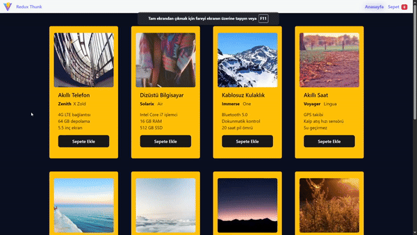

# React E-Ticaret Uygulaması

Bu proje, React kullanılarak geliştirilmiş bir e-ticaret uygulamasıdır. Kullanıcıların ürünleri görüntüleyebileceği, sepetlerine ürün ekleyebileceği ve satın alma işlemlerini gerçekleştirebileceği bir platform sağlar.

## Özellikler

- **Anasayfa:** Kullanıcılara ürünlerin listelendiği ana sayfa.
- **Sepet Sayfası:** Kullanıcıların sepetlerini görüntüleyebilecekleri ve siparişlerini tamamlayabilecekleri sayfa.
- **Header:** Sayfalar arasında gezinmeyi sağlayan başlık bileşeni.

## Teknolojiler

- **React:** Kullanıcı arayüzünün geliştirilmesi için kullanılan JavaScript kütüphanesi.
- **React Router:** Sayfa yönlendirmesi için kullanılan React kütüphanesi.

## Kurulum

1. Bu repo'yu klonlayın:

   ```bash
   git clone https://github.com/kullanici/react-eticaret-uygulamasi.git
   ```

2. Proje dizinine gidin:

   ```bash
   cd react-eticaret-uygulamasi
   ```

3. Gerekli bağımlılıkları yükleyin:

   ```bash
   npm install
   ```

4. Uygulamayı başlatın:

   ```bash
   npm start
   ```

## Katkıda Bulunma

1. Bu repo'yu forklayın.
2. Yeni özellikler ekleyin veya hataları düzeltin.
3. Değişikliklerinizi commit edin.
4. Bir pull isteği (pull request) gönderin.

## Ekran Görüntüsü


